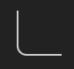

<h1 align="center">Corner Rounder</h1>
<p align="center">
  <em>Corner rounder with SVG integration</em>
</p>


<p align="center">
  <a href="https://img.shields.io/badge/License-MIT-green.svg" target="_blank">
    
  </a>
  <a href="https://badge.fury.io/js/corner-rounder.svg" target="_blank">
    
  </a>
</p>

## Overview

Corner Rounder rounds the corners of a path (or "route") of points. It provides the option to convert the result to SVG elements or SVG path commands.

## Usage Overview

```typescript
import roundCorners from 'corner-rounder'

const result = roundCorners({
  // Simple "L"-shape route
  route: [
    [0, 0],
    [0, 50],
    [50, 50]
  ],
  cornerArcRadius: 10,
})

// E.g. "M 0 0 L 0 40 A 10 10 0 0 0 10 50 L 50 50"
const d = result.toSvgPathDParameter()
// E.g. (SVGLineElement | SVGPathElement)[]
const svgLineAndArcElements = result.toSvgLineAndArcs()
```

The result of this, rendering with SVG, looks something like this:



## Examples

Corner Rounder uses [Exhibitor](https://github.com/samhuk/exhibitor) to demo itself with some example routes. To view these, clone the repository, run `npm i && npm run exh`, then navigate to http://localhost:4001.

## Development

See [./contributing/development.md](./contributing/development.md)

---

If you would like to support my open-source development, feel free to [sponsor me on GitHub](https://github.com/sponsors/samhuk) or [buy me a coffee](https://www.buymeacoffee.com/samhuk) ✨
